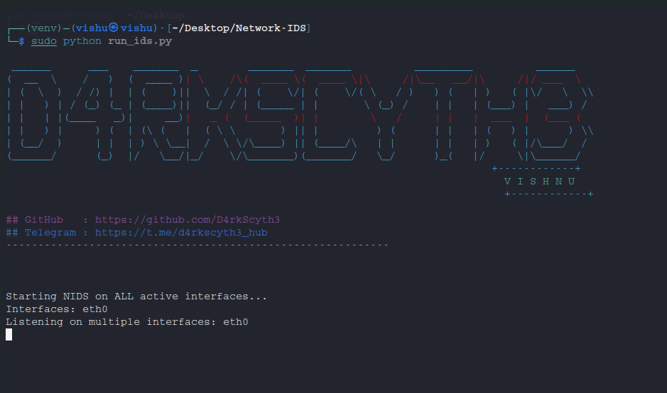

###### **Network Intrusion Detection System (NIDS):-**


A lightweight Python-based Intrusion Detection System (IDS) that monitors live network traffic and detects suspicious activities in real time. This project is designed for educational and research purposes to demonstrate how packet sniffing and anomaly detection can work together.


###### **Features:-**


* Live Packet Capture – Monitors all active network interfaces using Scapy.
* Suspicious Activity Detection – Detects unusual traffic patterns such as high packet bursts in short intervals.
* Logging System – Saves suspicious events with timestamps in organized log files.
* Cross-Platform – Runs on both Windows and Linux (requires admin/root privileges).
* Modular Design – Easy to extend with new detection rules.


###### Tools \& Technologies Used:-


* Python 3.10+ – Programming Language
* Scapy – For packet sniffing and analysis
* Datetime \& OS libraries – For logging and file management
* Modular Python scripts – Separation of concerns (sniffer, analyzer, IDS runner).


###### uses:-

###### in windows:-

**install requirements -**
* `pip install -r requirements.txt`
  
**After installing requirements Simply run -**
* `python run_ids.py`

###### in kali-linux:-

**install requirements -** 
* ```python3 -m venv venv```
* ```source venv/bin/activate```
* ```pip3 install -r requirements.txt```

**After installing requirements Simply run -**
* `sudo python run_ids.py`
  
<br><br>



<br>
## Disclaimer:

This project is created for educational and research purposes only.  
The author is not responsible for any misuse or damage caused by this tool.  
Use this software only on systems you own or have explicit permission to test.

